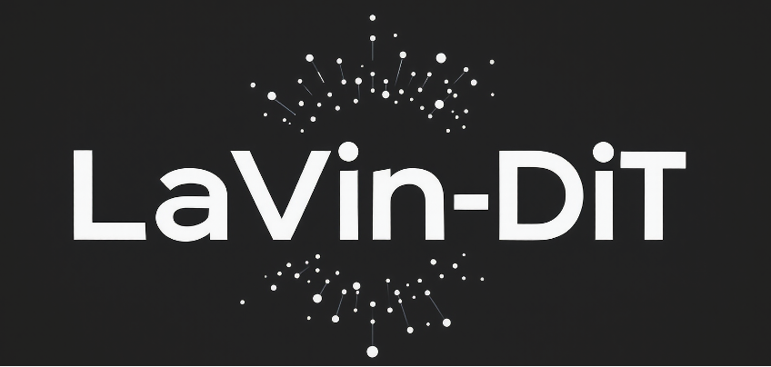

<div align="center">
  <p>
    
  </p>
  <h1>
    LaVin-DiT: Large Vision Diffusion Transformer
  </h1>
</div>

<p align="center">
  <a href="https://scholar.google.com/citations?user=ZqOjPKQAAAAJ&hl=en">Zhaoqing Wang</a>
  &nbsp;·&nbsp;
  <a href="https://scholar.google.co.jp/citations?user=jRsugY0AAAAJ&hl=en">Xiaobo Xia</a>
  &nbsp;·&nbsp;
  <a href="https://scholar.google.com/citations?user=Uq2DuzkAAAAJ&hl=zh-CN">Runnan Chen</a>
  &nbsp;·&nbsp;
  <a href="https://scholar.google.com/citations?user=B2RmjSYAAAAJ&hl=zh-CN">Dongdong Yu</a> <br>
  <a href="https://scholar.google.com/citations?user=DsVZkjAAAAAJ&hl=en">Changhu Wang</a>
  &nbsp;·&nbsp;
  <a href="https://scholar.google.com.au/citations?user=6BmiCJIAAAAJ&hl=en">Mingming Gong</a>
  &nbsp;·&nbsp;
  <a href="https://scholar.google.com.au/citations?user=EiLdZ_YAAAAJ&hl=en">Tongliang Liu</a>
</p>
<!-- <h3 align="center">ECCV 2024 Oral</h3> -->
<h3 align="center"><a href="https://arxiv.org/abs/2411.11505">Paper</a> | <a href="https://derrickwang005.github.io/LaVin-DiT/">Project Page</a> | <a href="https://drive.google.com/drive/folders/14_E_5R6ojOWnLSrSVLVEMHnTiKsfddjU">Pretrained Models</a> </h3>

<ul>
<li><b>2025/1/27 Update:</b> Release inference code and pretrained models!</li>
<li><b>2024/11/24 Update:</b> Add project homepage, <a href="https://derrickwang005.github.io/LaVin-DiT/">LaVin-DiT</a>!</li>
</ul>
<br>
</p>

## Installation

To get started, clone this project, create a conda virtual environment using Python 3.10+, and install the requirements:

```bash
# clone the repo
git clone https://github.com/DerrickWang005/LaVin-DiT.git
cd LaVin-DiT

# create conda environment
conda create -n lavin python=3.10
conda activate lavin
conda install pytorch==2.2.1 torchvision==0.17.1 torchaudio==2.2.1 pytorch-cuda=12.1 -c pytorch -c nvidia
pip install -r requirements.txt

# apex
git clone https://github.com/NVIDIA/apex
cd apex
# if pip >= 23.1 (ref: https://pip.pypa.io/en/stable/news/#v23-1) which supports multiple `--config-settings` with the same key... 
pip install -v --disable-pip-version-check --no-cache-dir --no-build-isolation --config-settings "--build-option=--cpp_ext" --config-settings "--build-option=--cuda_ext" ./
# otherwise
pip install -v --disable-pip-version-check --no-cache-dir --no-build-isolation --global-option="--cpp_ext" --global-option="--cuda_ext" ./

# flash attention
pip install packaging ninja
pip install flash-attn --no-build-isolation
```

## Inference

* Before running inference, please install git-lfs to download the pretrained models and template prompts.

```bash
curl -s https://packagecloud.io/install/repositories/github/git-lfs/script.deb.sh | sudo bash
sudo apt-get install git-lfs
```

* extract the pretrained models and template prompts

```bash
git clone https://huggingface.co/DerrickWang005/LaVin-DiT
mv template.tar.gz weights.tar.gz ../
rm -rf LaVin-DiT
tar xzf template.tar.gz
tar xzf weights.tar.gz
```

* we provide some test examples under `test_sample/`. You can run the following command to process multiple vision tasks, e.g., depth estimation, surface normal estimation, etc:

```bash
export PYTHONPATH="."
export VAE_CKPT="weights/stvae.pt"
export DIT_CKPT="weights/lavin_dit.safetensors"
export QUERY_IMAGE="test_sample/hinton.png"
export OUTPUT="hinton.png"


# depth estimation
python inference.py \
    --query $QUERY_IMAGE \
    --output result_depth_$OUTPUT \
    --task_dir template/depth_estimation \
    --vae_path $VAE_CKPT \
    --dit_path $DIT_CKPT \
    --height 512 \
    --width 512

# surface normal estimation
python inference.py \
    --query $QUERY_IMAGE \
    --output result_normal_$OUTPUT \
    --task_dir template/normal_estimation \
    --vae_path $VAE_CKPT \
    --dit_path $DIT_CKPT \
    --height 512 \
    --width 512

# panoptic segmentation
python inference.py \
    --query $QUERY_IMAGE \
    --output result_pseg_$OUTPUT \
    --task_dir template/panoptic_segmentation \
    --vae_path $VAE_CKPT \
    --dit_path $DIT_CKPT \
    --height 512 \
    --width 512
```
More information can be found in `infer.sh`.


## BibTeX

```bibtex
@article{wang2024lavin,
  title={LaVin-DiT: Large Vision Diffusion Transformer},
  author={Wang, Zhaoqing and Xia, Xiaobo and Chen, Runnan and Yu, Dongdong and Wang, Changhu and Gong, Mingming and Liu, Tongliang},
  journal={arXiv preprint arXiv:2411.11505},
  year={2024}
}
```

## Acknowledgements

The project is based on [SiT](https://github.com/willisma/SiT), [Flux](https://github.com/black-forest-labs/flux) and [CogVideoX](https://github.com/THUDM/CogVideo). Many thanks to these three projects for their excellent contributions!